# CEG5003 Factory — Agentic AI for Manufacturing in Industry 5.0

## System Architecture

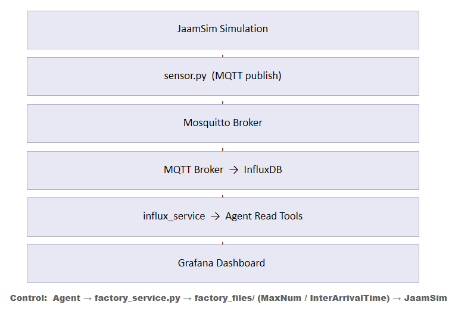

**Upward data path:** JaamSim → `sensor.py` (MQTT publish) → Mosquitto broker → MQTT bridge → InfluxDB → Grafana

**Downward control path:** Agent → `factory_service.py` → `factory_files/` (MaxNum / InterArrivalTime text files) → JaamSim (FileToVector)

---

## Factory Simulation

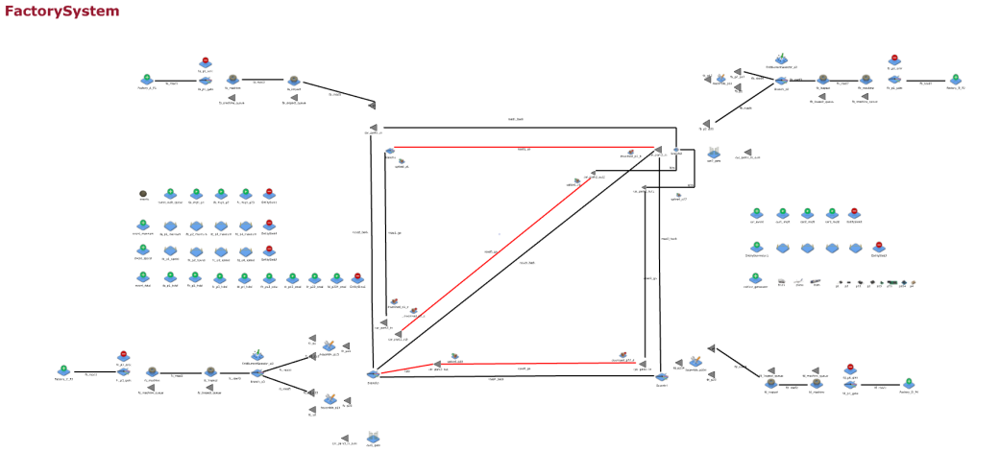

The simulation models a four-factory supply chain in JaamSim (real-time, `RealTimeFactor = 1`). Each factory has an EntityGenerator, a two-stage inspect-and-machine Server sequence, and output queues. A fleet of three shared trucks transports intermediate products along a shared road network.

### Factory Topology and Assembly Dependencies

| Factory | Raw Material | Assembled Products | Assembly Inputs |
|---------|--------------|--------------------|-----------------|
| FA | P1 | — | — |
| FB | P2 | P12 | P1 + P2 |
| FC | P3 | P13, P23 | P13: P1+P3 / P23: P2+P3 |
| FD | P4 | P234 | P23 + P4 |

FD cannot produce P234 until P23 arrives from FC; FC cannot produce P23 until P2 is delivered from FB — a cascading upstream dependency chain.

### Component Icons

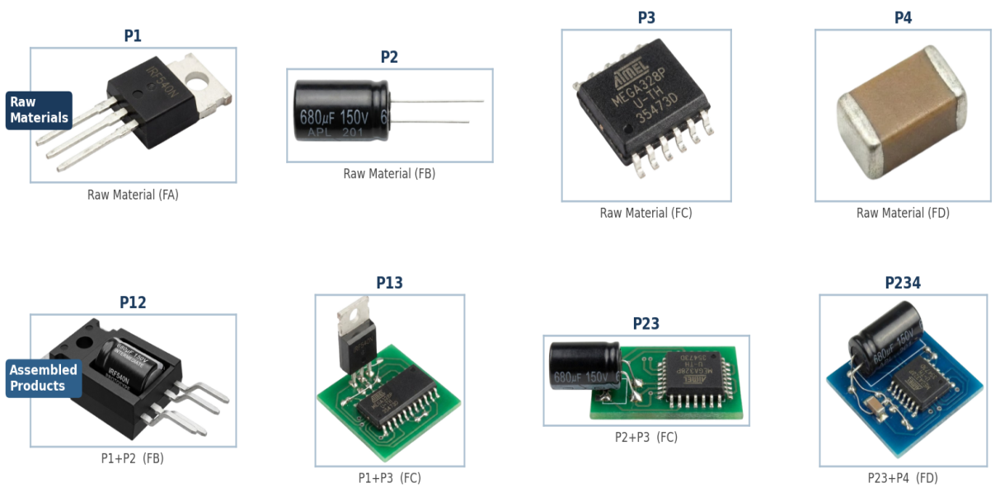

Raw materials P1–P4 (top row) and assembled products P12, P13, P23, P234 (bottom row), generated with Nano Banana.

### Logistics Vehicles

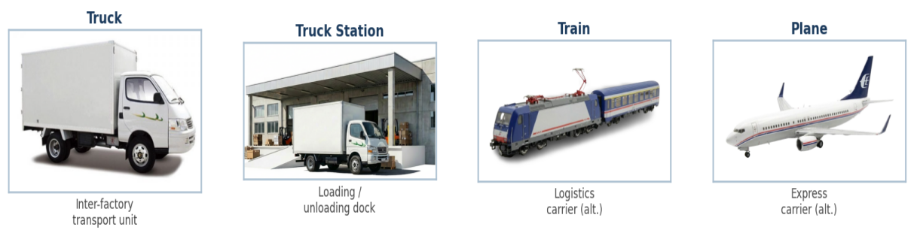

Truck (inter-factory transport), truck station (loading dock), and alternative carrier models (train, plane).

### Runtime Control via FileToVector

Production parameters are modified **at runtime without restarting the simulation** through a file-polling interface:

- **MaxNum** (`factory_files/MaxNum/*.txt`) — production plan cap. A Branch gate routes entities to the machine while `NumberAdded < MaxNum`, then to a sink. The simulation polls the file every second.
- **InterArrivalTime** (`factory_files/InterArrivalTime/*.txt`) — throughput control. Writing `3` → ~20 units/min; writing `10` → ~6 units/min.

This file-based bridge is the critical interface that enables agent control of JaamSim without any custom plugin or API.

---

## Agent Interface

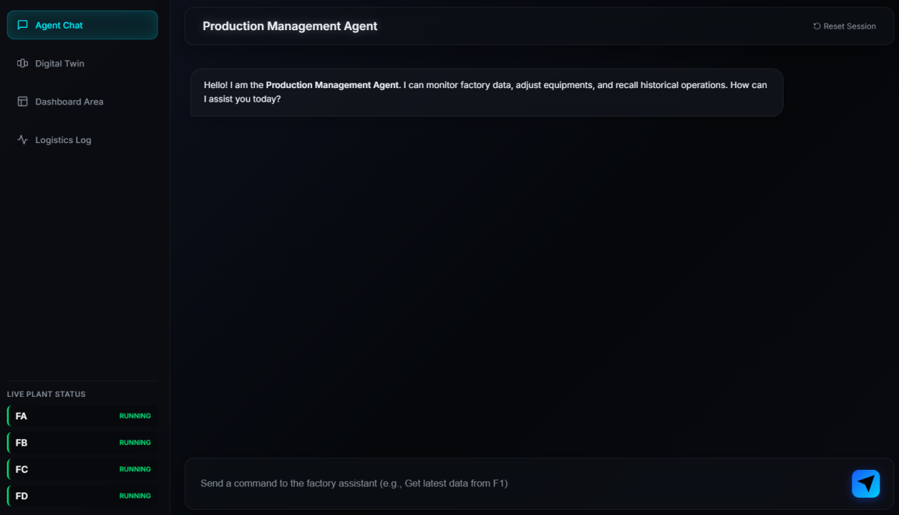

A FastAPI web application (port 8891) with a chat panel and a live factory status sidebar. Supports natural language in English and Chinese.

### Supported Commands

| Category | Examples |
|----------|---------|
| Production overview | `Production overview` |
| Time-range query | `Past 3 minutes production` |
| Queue status | `Waiting queue status` |
| Trend analysis | `Is output increasing?` / `Trend analysis` |
| Memory query | `Search memory for previous settings` |
| Set plan quantity | `Set factory A plan quantity to 200` |
| Set production speed | `Set factory C production speed to 4 seconds` |
| Emergency shutdown | `Emergency shutdown factory B` |
| Restart production | `Restart factory B` |

---

## Agent Loop Design

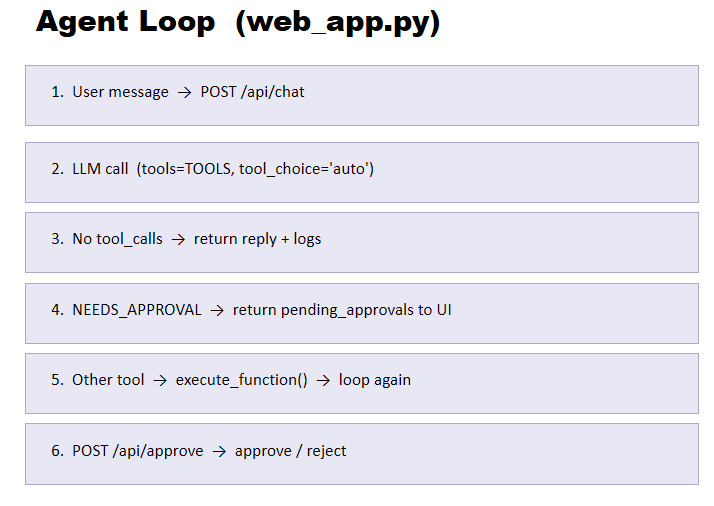

The loop departs from standard ReAct in two ways:

1. **Pattern-driven pre-filter** — time-range phrases (e.g. "past 3 minutes") are detected by regex and routed directly to `get_production_delta`, bypassing LLM tool selection. Eliminates hallucinated tool calls for the highest-frequency query type.

2. **NEEDS_APPROVAL state** — any write tool call is intercepted before execution. A structured approval request (tool name, factory ID, proposed parameters) is returned to the UI. The tool executes only after `POST /api/approve` with `approved=true`.

**State machine:** `RUNNING → NEEDS_APPROVAL → (approved / rejected) → RUNNING`

When estimated context exceeds 22,000 tokens, the agent automatically compresses history into `session_log.md` and resets the active context to the system prompt plus the four most recent exchanges.

---

## Tool System (11 tools)

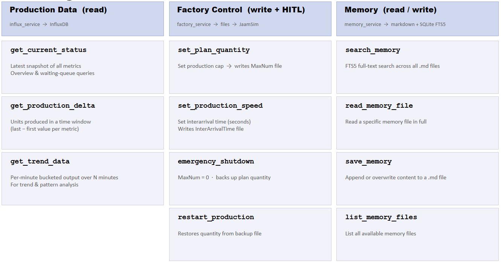

### Production Data — read-only, queries InfluxDB

| Tool | Description |
|------|-------------|
| `get_current_status` | Latest snapshot of all metrics — overview and queue queries |
| `get_production_delta` | Units produced within a time window (last − first value, counter-reset guarded) |
| `get_trend_data` | Per-minute bucketed output over N minutes via `aggregateWindow` |

### Factory Control — write + HITL, writes simulation files

| Tool | Description |
|------|-------------|
| `set_plan_quantity` | Writes integer to MaxNum file |
| `set_production_speed` | Writes float inter-arrival time (seconds) to InterArrivalTime file |
| `emergency_shutdown` | Sets MaxNum to 0; backs up current value to `MaxNum_backup/` |
| `restart_production` | Reads backup and restores saved quantity — no re-entry required |

### Memory — read/write, Markdown + SQLite FTS5

| Tool | Description |
|------|-------------|
| `search_memory` | FTS5 full-text search across all memory files |
| `read_memory_file` | Read a specific memory file in full |
| `save_memory` | Append or overwrite content to a memory file |
| `list_memory_files` | List all available memory files |

---

## Memory Architecture

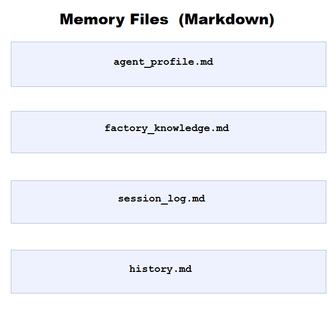

Three persistent Markdown files are loaded into the system prompt at every session start:

- **`agent_profile.md`** — agent role, persona, and response style
- **`factory_knowledge.md`** — complete factory topology, assembly dependencies, product codes, tool selection rules, and expected output table formats
- **`session_log.md`** — auto-compressed summaries of past sessions, written on every token-limit event

`history.md` records the full conversation log.

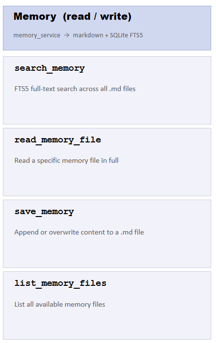

A SQLite FTS5 index (`memory.db`) is synchronised with the Markdown files on every write, enabling keyword search across all memory content across sessions.

---

## Human-in-the-Loop Safety

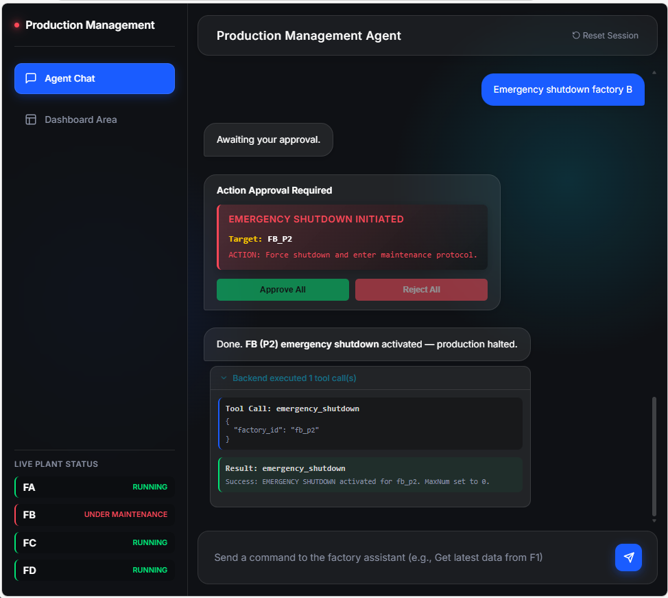

All four factory control tools are gated by an explicit approval workflow at the web application layer, independent of the LLM. The operator sees the tool name, factory ID, and proposed parameter values before any file is written. Approval or rejection is captured within the same conversational context as the original request.

---

## Grafana Dashboard

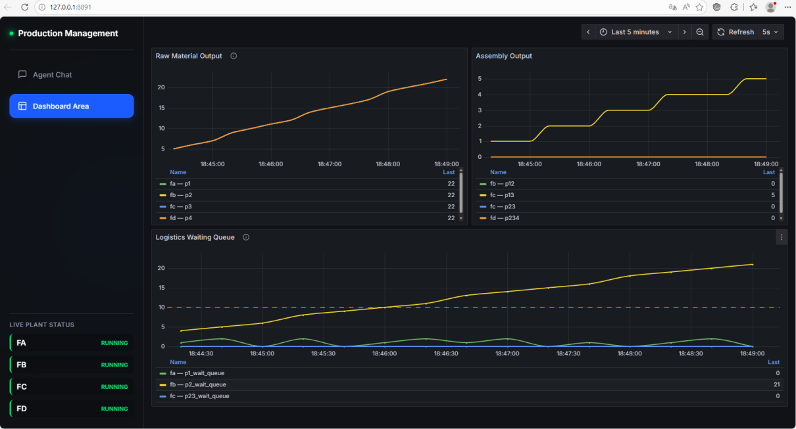

Three panels, always-on and independent of the agent session:

- **Raw Material Output** — cumulative P1/P2/P3/P4 counts, 1-minute aggregation window
- **Assembly Output** — P12/P13/P23/P234 on the same time axis, reveals assembly lag relative to raw supply
- **Logistics Waiting Queue** — buffer depths with threshold colour coding: green < 10 (normal), yellow 10–50 (warning), red > 50 (critical)

Import `grafana_dashboard.json` into any Grafana instance connected to the same InfluxDB bucket.

---

## Adaptive Logistics Controller & Digital Twin

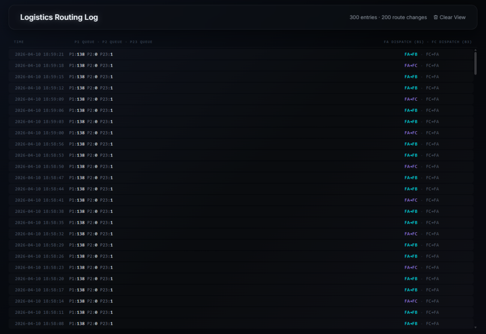

The logistics controller polls InfluxDB in real time and re-routes transport vehicles when queue depths cross configurable thresholds, preventing deadlock and reducing idle trips.

| Branch | Logic |
|--------|-------|
| FA → FC dispatch | Cycle-based redirect when P23 queue is low |
| FB → FC transfer | Always-active fixed route for P2 |
| FC → FA return | Triggered when P23 queue falls below threshold |
| FD → FC → FA | Standard return loop |

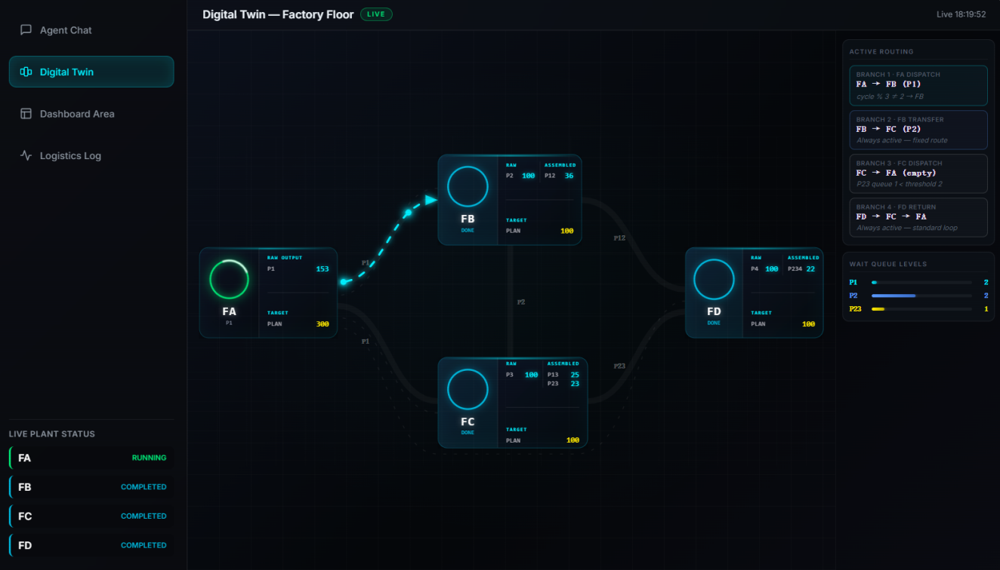

The digital twin renders a live SVG factory floor topology updated in real time from the MQTT/InfluxDB pipeline via a REST endpoint. Each factory node shows raw output, assembled output, and plan target. Active transport paths are animated as directional arrows.

---

## Example Results

### Time-range production query

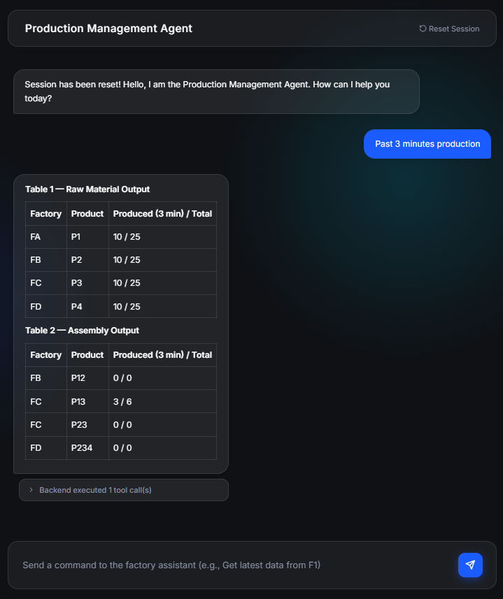

Regex pre-filter routes "past N minutes" queries directly to `get_production_delta`. Results are rendered as formatted Markdown tables, verified against direct InfluxDB Flux queries with exact numerical agreement.

### HITL approval for speed change

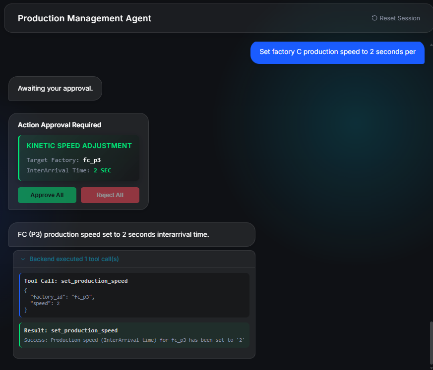

Parameter preview (factory ID, new inter-arrival time) is presented before execution. The simulation acknowledges the updated InterArrivalTime within one production cycle (under 5 seconds).

### Grafana ramp-up after speed adjustment

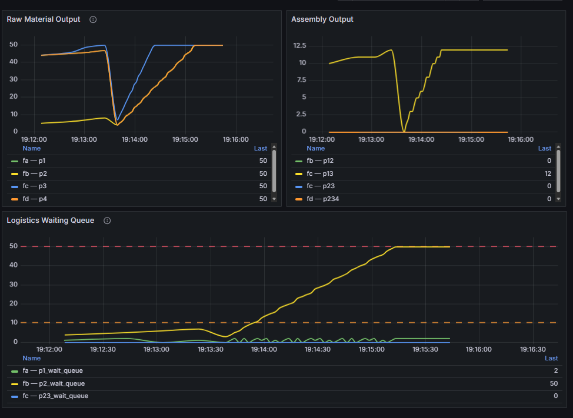

Production ramp-up captured in the Grafana dashboard following a `set_production_speed` command.

### Evaluation Summary

45 natural language queries across 9 command types (5 repetitions each):

| Scenario | Queries | Tool Accuracy |
|----------|---------|---------------|
| Production Monitoring (5 types × 5) | 25 | **25 / 25 — 100%** |
| Production Control (4 types × 5) | 20 | **20 / 20 — 100%** |

All control commands correctly gated by HITL. Agent results numerically consistent with direct InfluxDB records in all cases.

---

## Startup

Copy `.env.example` to `.env` and fill in API keys and InfluxDB credentials, then start in order:

1. Start **Mosquitto** (port 1883) and **InfluxDB** (port 8086)
2. Start **Grafana** (port 3000) and import `grafana_dashboard.json` via Grafana → Dashboards → Import
3. Open **JaamSim** with `simulation_files/simulation.cfg` and run the simulation
4. Start the MQTT bridge:
   ```bash
   python mqtt_bridge/main.py
   ```
5. Start the agent:
   ```bash
   cd factory_agent
   python -m uvicorn web_app:app --host 127.0.0.1 --port 8891
   ```
   Open `http://127.0.0.1:8891` in browser.

Or use the one-click launcher: `start.bat`

---

## Project Structure

```
CEG5003_factory/
├── grafana_dashboard.json          # Import into Grafana
├── start.bat                       # One-click startup
├── docs/images/                    # Screenshots and diagrams
├── factory_agent/
│   ├── config.py                   # LLM / InfluxDB credentials and settings
│   ├── agent_core.py               # LLM client, session init, token/memory management
│   ├── web_app.py                  # FastAPI server, agent loop, HITL state machine
│   ├── tools.py                    # Tool definitions (OpenAI function-call format) and dispatcher
│   ├── factory_service.py          # Read/write simulation control files
│   ├── influx_service.py           # Query production data from InfluxDB
│   ├── memory_service.py           # Long-term memory (Markdown + SQLite FTS5)
│   └── memory/
│       ├── agent_profile.md        # Agent role and response style
│       ├── factory_knowledge.md    # Domain knowledge, topology, tool selection rules
│       ├── session_log.md          # Auto-saved session compression summaries
│       └── history.md              # Full conversation history
├── mqtt_bridge/
│   ├── config.py                   # MQTT and InfluxDB connection config
│   └── main.py                     # MQTT subscriber → InfluxDB writer
├── logistics_ctrl/
│   └── branch_controller.py        # Adaptive logistics dispatch controller
├── simulation_files/
│   ├── simulation.cfg              # JaamSim simulation config
│   ├── sensor.py                   # JSON-RPC MQTT publisher (called by JaamSim)
│   ├── factory_files/
│   │   ├── MaxNum/                 # Runtime production caps (written by agent)
│   │   ├── InterArrivalTime/       # Runtime production speeds (written by agent)
│   │   └── MaxNum_backup/          # Pre-shutdown backups (written by emergency_shutdown)
│   └── display_model_logos/        # Component and vehicle icons for JaamSim
└── web_ui/
    └── index.html                  # Digital twin frontend
```

---

## MQTT Topics

| Topic | Source Expression | Meaning |
|-------|-------------------|---------|
| `factory/fa/p1_wait_queue` | `[fa_p1].QueueLength` | P1 buffer depth at FA |
| `factory/fa/p1/total` | `[fa_machine].NumberAdded` | Cumulative P1 produced |
| `factory/fb/p2_wait_queue` | `[fb_p2_p23].QueueLength` | P2 buffer at FB (for FC) |
| `factory/fb/p2/total` | `[fb_machine].NumberAdded` | Cumulative P2 produced |
| `factory/fb/p12/total` | `[Assemble_p12].NumberAdded` | Cumulative P12 assembled |
| `factory/fc/p23_wait_queue` | `[fc_p23].QueueLength` | P23 buffer at FC (for FD) |
| `factory/fc/p3/total` | `[fc_machine].NumberAdded` | Cumulative P3 produced |
| `factory/fc/p13/total` | `[Assemble_p13].NumberAdded` | Cumulative P13 assembled |
| `factory/fc/p23/total` | `[Assemble_p23].NumberAdded` | Cumulative P23 assembled |
| `factory/fd/p4/total` | `[fd_machine].NumberAdded` | Cumulative P4 produced |
| `factory/fd/p234/total` | `[Assemble_p234].NumberAdded` | Cumulative P234 assembled |

Pipeline latency from simulation event to InfluxDB entry: consistently under 1 second in local deployment.
